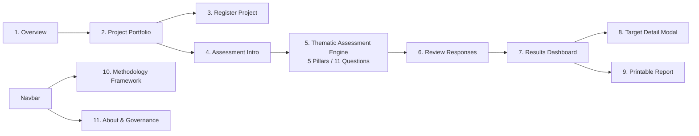

# Agriculture4allSDGs

> **Agriculture Impact Assessment for Sustainable Development**  
> *Developed for potential collaboration with SDG Champions, France.*

[](https://vitejs.dev/)
[](https://react.dev/)
[](https://www.typescriptlang.org/)
[](https://tailwindcss.com/)
[](LICENSE)

---

## Executive Overview

**Agriculture4allSDGs** is a specialized sustainability impact-assessment web application. It adapts the proven **4allSDGs** methodology—developed by **SDG Champions, France**—specifically to the agricultural sector.

Traditional ESG checklists often treat agriculture as a generic industrial process, missing critical agronomic complexities. Agriculture4allSDGs bridges this gap by translating farm-level practices (irrigation efficiency, soil organic carbon enhancement, agroforestry, rural electrification, and farmer livelihoods) directly into **United Nations Sustainable Development Goals (SDGs)** and their respective **2030 Agenda targets**.

---

## Core Product Principles

1. **Context-Driven Agronomy**  
   Evaluates impact across 5 core agricultural pillars rather than broad corporate questionnaires.
2. **Transparent Trade-Off Tracking**  
   Farming practices can carry unintentional trade-offs (such as increased groundwater extraction from expanded irrigation or ongoing fossil-fuel generator use). The platform logs positive contributions and trade-offs independently—never netting them out to conceal risks or enable greenwashing.
3. **Evidence-Backed Confidence**  
   Impact magnitude is decoupled from audit confidence. Unverified assumptions or missing regional data are flagged as *"Evidence Required"*, providing a clear roadmap for on-the-ground verification.
4. **Data-Driven & Replaceable Taxonomy**  
   The scoring engine is completely decoupled from UI code. SDG Champions can update or replace question sets, target linkages, and scoring weights via structured JSON configuration without engineering overhead.

---

## The 5 Thematic Evaluation Pillars

| # | Thematic Pillar | Focus Areas & Practices | Primary UN SDGs |
|---|---|---|---|
| **1** | **Water Management** | Precision drip irrigation, rainwater harvesting, irrigation scheduling, aquifer pressure, watershed neutrality. | **SDG 6** (Target 6.4)<br>**SDG 12** (Target 12.2) |
| **2** | **Soil Health & Land Stewardship** | Crop rotation, cover crops, compost application, reduced tillage, soil testing, land degradation neutrality. | **SDG 2** (Target 2.4)<br>**SDG 15** (Target 15.3)<br>**SDG 12** (Target 12.2) |
| **3** | **Energy & Climate** | Solar PV water pumping, biogas digesters, farm machinery electrification, emissions mitigation plans. | **SDG 7** (Target 7.2)<br>**SDG 13** (Target 13.2) |
| **4** | **Biodiversity & Resource Use** | Ecological hedgerows, pollinator strips, organic residue composting, safe chemical disposal, circular inputs. | **SDG 15** (Target 15.1)<br>**SDG 12** (Targets 12.4, 12.5) |
| **5** | **People & Farmer Livelihoods** | Farmer capacity training, occupational health & safety (PPE), living wages, participatory community governance. | **SDG 1** (Target 1.4)<br>**SDG 3** (Target 3.9)<br>**SDG 4** (Target 4.4)<br>**SDG 8** (Targets 8.3, 8.5, 8.8)<br>**SDG 16** (Target 16.7)<br>**SDG 17** (Target 17.17) |

---

## User Journey & Core Modules



### 1. Platform Overview (`/`)
High-level strategic entry point outlining the assessment methodology, active field snapshots, and the 3-step evaluation journey.

### 2. Project Portfolio (`/projects`)
Filterable project registry with status tags (`Completed Assessment`, `In Progress`, `Not Started`), search capabilities, and pre-enrolled field initiatives:
- **Green Valley Water-Smart Farming Initiative** (Ahmedabad, Gujarat, India — 50 ha, drip irrigation, solar water pumping, mixed crops).
- **Regenerative Soil & Farmer Livelihoods Pilot** (Anand, Gujarat, India — 25 ha, cover cropping, vermicomposting, diversified farming).

### 3. Project Registration (`/create-project`)
Multi-step form capturing farm area (hectares/acres), project stage (Idea, Planning, Pilot, Operating, Scaling), location, crop type, and baseline practices with client-side validation.

### 4. Dynamic Thematic Question Engine (`/assessment-flow`)
- Guided step-by-step questionnaire across the 5 pillars (11 structured questions).
- Displays trigger questions, options with live SDG mapping previews, expandable qualitative evidence textareas, and confidence level selectors.
- Includes an **"Autofill Baseline"** button for instant end-to-end client demonstrations.

### 5. Assessment Review (`/assessment-review`)
Summary table grouping answers by theme, highlighting completed questions, logged qualitative field notes, and quick jump-to-edit capabilities.

### 6. Results Dashboard (`/results`)
Executive dashboard displaying:
- **Top KPI Cards**: Themes Assessed, Total Positive Contribution Score, Trade-offs & Attention Flags, Overall Audit Confidence.
- **SDG Impact Signals Matrix**: Horizontal comparative progress bars with UN SDG color badges.
- **Key Positive Contributions**: Cards detailing the impact area, relevant UN SDG Target, rationale, and source answers.
- **Trade-Offs & Attention Signals**: Crucial section identifying operational risks (e.g. aquifer drawdown, fossil backup generators) with recommended remedial actions.
- **Interactive SDG Directory**: Click any SDG to open target-by-target inspection.

### 7. SDG Target Inspection Modal
Detailed modal drawer displaying mapped targets, official UN descriptions, contributing farm practices, and qualitative evidence notes.

### 8. Official Assessment Report (`/report`)
Print-ready (`@media print` optimized) executive report complete with formal document reference ID, project metadata, executive narrative, SDG contribution table, and methodology accreditation standards. Supports one-click **Print** and **Download PDF**.

### 9. Methodology Framework Explorer (`/config`)
Interactive administrative explorer displaying the underlying JSON schema: themes, questions, options, target codes, weights, and explanations. Demonstrates how easily SDG Champions can calibrate or expand the rule base.

### 10. Platform Governance & Roadmap (`/about`)
Contextualizes the collaboration with SDG Champions, explaining the ethical stance on trade-off visibility, evidence tiers, and the production roadmap (multilingual support, GIS/satellite verification, cooperative group accounts).

---

## Project Structure

```
Agriculture4allSDGs/
├── index.html                     # Main HTML template with modern typography
├── package.json                   # Dependencies and scripts
├── postcss.config.js              # PostCSS configuration
├── tailwind.config.js             # Custom colors (Forest, Sage, Earth, official UN SDG 1-17)
├── tsconfig.json                  # TypeScript root configuration
├── tsconfig.app.json              # TypeScript application configuration
├── vercel.json                    # Vercel SPA routing configuration
├── public/
│   └── leaf-icon.svg              # Brand icon / favicon
└── src/
    ├── main.tsx                   # Application entry point
    ├── App.tsx                    # Root orchestrator, route state, and calculation hooks
    ├── index.css                  # Global Tailwind CSS and @media print styling
    ├── types/
    │   └── index.ts               # Core TypeScript definitions (Projects, SDGs, Questions, Results)
    ├── data/
    │   ├── sdgs.ts                # Reference dataset for 17 UN SDGs and targets
    │   ├── methodologyConfig.ts   # Configurable 5 themes, 11 questions, options, weights
    │   └── demoProjects.ts        # Pre-seeded field projects and baseline answer sets
    ├── services/
    │   ├── assessmentEngine.ts    # Rule-based calculation engine (positive & negative signals)
    │   └── storage.ts             # LocalStorage persistence and reset utilities
    └── components/
        ├── common/
        │   ├── Navbar.tsx         # Responsive enterprise navigation with project switcher
        │   ├── Footer.tsx         # Platform footer with methodology standards note
        │   └── SDGBadge.tsx       # Official UN SDG color-coded badge component
        ├── modals/
        │   └── SDGDetailModal.tsx # Deep-dive target breakdown and explanation drawer
        └── screens/
            ├── WelcomeScreen.tsx          # Overview landing screen
            ├── ProjectsScreen.tsx         # Project registry and search
            ├── CreateProjectScreen.tsx    # Multi-step project setup form
            ├── AssessmentIntroScreen.tsx  # Context summary before evaluation
            ├── AssessmentFlowScreen.tsx   # Dynamic step-by-step question runner
            ├── AssessmentReviewScreen.tsx # Pre-calculation audit view
            ├── ResultsDashboardScreen.tsx # Comprehensive results, trade-offs & matrix
            ├── ReportViewScreen.tsx       # Print-ready executive PDF report
            ├── MethodologyConfigScreen.tsx# Rule engine explorer & JSON viewer
            └── AboutScreen.tsx            # Methodology background & production roadmap
```

---

## Getting Started

### Prerequisites
- **Node.js**: v18.0.0 or higher (v22.x recommended)
- **npm**: v9.0.0 or higher

### Installation

1. Clone the repository:
   ```bash
   git clone https://github.com/drdhavaltrivedi/Agriculture4allSDGs.git
   cd Agriculture4allSDGs
   ```

2. Install dependencies:
   ```bash
   npm install
   ```

3. Launch the development server:
   ```bash
   npm run dev
   ```
   Open your browser at `http://127.0.0.1:5173/`.

4. Build for production:
   ```bash
   npm run build
   ```

---

## Deployment to Vercel

The project includes a ready-to-use `vercel.json` configuration for single-page applications.

### Option A: Using Vercel CLI

```bash
# Login to Vercel (if not already authenticated)
vercel login

# Deploy preview
vercel

# Deploy to production
vercel --prod
```

### Option B: Using GitHub Integration
1. Push this repository to GitHub.
2. Go to [Vercel Dashboard](https://vercel.com/new).
3. Import the `Agriculture4allSDGs` repository.
4. Set framework preset to **Vite**.
5. Click **Deploy**.

---

## Methodology Customization Guide

All scoring logic is driven by data in [`src/data/methodologyConfig.ts`](./src/data/methodologyConfig.ts).

To customize or calibrate rules:
1. **Add/Modify Questions**: Adjust question text, theme assignments, or question codes in `DEMO_QUESTIONS`.
2. **Adjust SDG Linkages**: Modify the `effects` array inside any option:
   ```typescript
   {
     sdgNumber: 6,
     targetCode: '6.4',
     direction: 'positive', // or 'negative'
     score: 3,              // +1 to +3 (positive) or -1 to -3 (negative)
     impactArea: 'Water-Use Efficiency',
     explanation: 'Direct root-zone delivery minimizes evaporation losses.'
   }
   ```
3. **Trade-Off Alerts**: Add `attentionRequired: true` and `suggestedAction: "..."` to trigger remedial action recommendations in the dashboard.

---

## Collaboration & Governance

- **Platform Concept**: Prepared for discussion with **SDG Champions, France**.
- **UN 2030 Alignment**: Mapped against official United Nations Sustainable Development Goals.
- **License**: MIT License.
